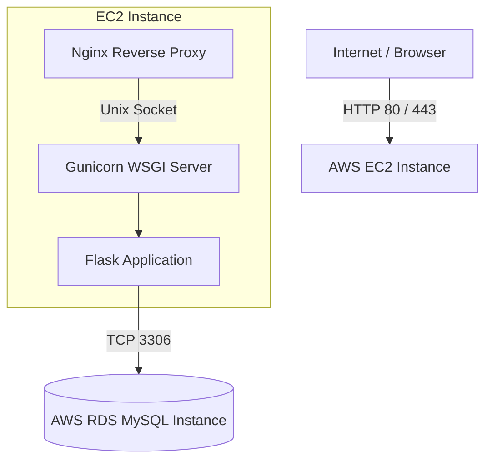

# Pathfinding Visualizer

A dynamic web application to visualize and understand popular pathfinding algorithms like **BFS**, **DFS**, **Dijkstra**, **A\*** and more. Built using **Flask** for the backend and **HTML5 Canvas** with JavaScript for the frontend.

## Architecture

This project is built to run both locally using Docker for the database, and in the cloud on AWS.


### Target AWS Architecture



## Getting Started (Local Development)

Follow the steps below to set up and run this project locally:

### 1. Clone the repository

```bash
git clone https://github.com/your-username/pathfinding-visualizer.git
cd pathfinding-visualizer
```

### 2. Start the Local Database

Ensure Docker Desktop is running, then start the MySQL container:
```bash
docker-compose up -d
```
See [README-db.md](README-db.md) for more details on the database setup.

### 3. Create and activate virtual environment

```bash
python -m venv venv
```
**On Windows:**
```bash
venv\Scripts\activate
```
**On macOS/Linux:**
```bash
source venv/bin/activate
```

### 4. Install dependencies

```bash
pip install -r requirements.txt
```

### 5. Run the development server

```bash
python server.py
```
*(To enable debug mode, set the `FLASK_DEBUG=True` environment variable before running).*

Once the server is running, open your browser and visit `http://127.0.0.1:5000`.

## Performance Load Testing

The pathfinding API has been stress-tested using Locust. Under high concurrency, the application sustains over 60 req/s with a zero-failure rate, though intensive algorithms like BFS and Dijkstra on large sparse grids can hit 2.1s p95 latencies.

Check out [PERFORMANCE.md](PERFORMANCE.md) for the full load testing metrics and analysis.

## AWS Deployment

Ready to take it live? A comprehensive manual deployment guide for the AWS Free Tier (EC2 + RDS) is available. 
Check out [DEPLOY.md](DEPLOY.md) for step-by-step instructions.

## Tech Stack

- **Frontend:** HTML5, CSS3, JavaScript (Canvas API)
- **Backend:** Python, Flask, Gunicorn/Waitress
- **Database:** MySQL 8, SQLAlchemy
- **Load Testing:** Locust

## Contributions

Feel free to open issues or pull requests to improve the project!

---
*Built to make algorithms visually intuitive.*
